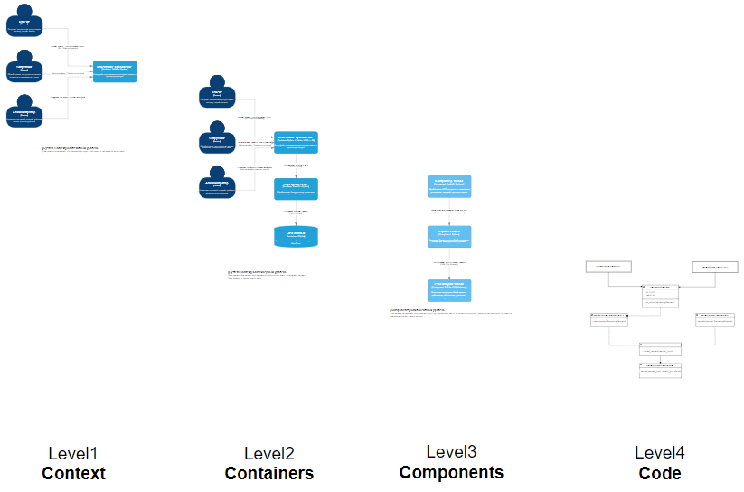
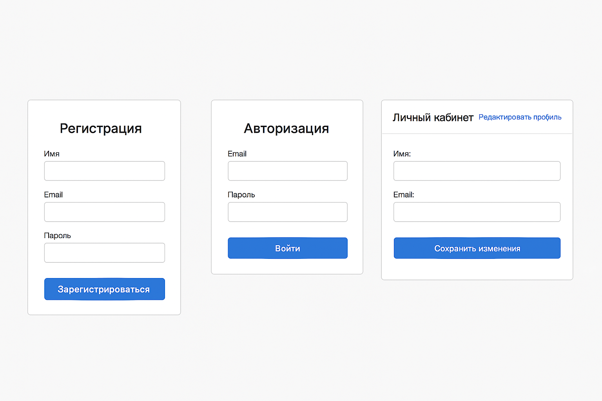
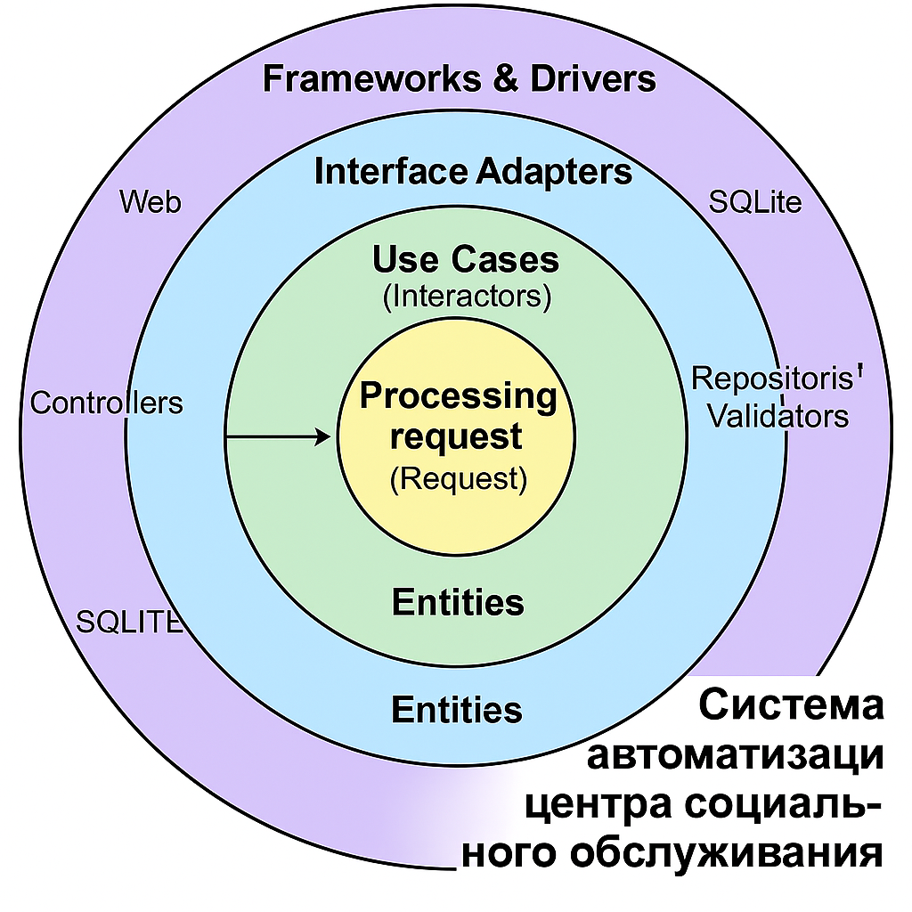

# KotsubaIV_214371_RIOPK_Spec
содержит описание ПС
## Диаграмма вариантов использования

## С4-модель архитектуры программного средства

## Система дизайна пользовательского интерфейса
Проект использует унифицированную систему дизайна для всех страниц, чтобы обеспечить единый пользовательский опыт.

### Основные элементы управления

| Элемент            | Шрифт            | Цвет                      | Форма             | Поведение                            |
|--------------------|------------------|---------------------------|-------------------|--------------------------------------|
| Заголовки          | Montserrat, Bold | #1A1A1A                   | —                 | Используются на всех страницах       |
| Основной текст     | Roboto, Regular  | #333333                   | —                 | Для описания и меток                 |
| Кнопка (основная)  | Roboto, Medium   | Белый текст / #007BFF фон | Скруглённая (6px) | Наведение: светлее, нажатие — темнее |
| Поле ввода         | Roboto, Regular  | Белый фон / серая рамка   | Прямоугольное     | При фокусе — синяя рамка             |
| Уведомление        | Roboto, Regular  | Белый текст / #28a745 фон | Скруглённое       | Всплывает при успехе действия        |

---

## 📐 Макеты пользовательских страниц

Для проектирования интерфейса были созданы простые прототипы (wireframes) всех основных страниц системы:

### 🧾 Страницы:
1. **Экран входа** — форма авторизации с логином и паролем.
2. **Экран регистрации** — форма создания аккаунта.
3. **Личный кабинет клиента** — просмотр заявок, отправка новой заявки, статус.
4. **Личный кабинет сотрудника** — список заявок, кнопки обработки, связь с клиентом.
5. **Панель администратора** — управление пользователями и ролями.
6. **Форма заявки** — ввод информации, прикрепление файлов и подтверждение.

### 🖼️ Прототип интерфейса
)
> _Изображение макета страниц_

---

## ℹ️ Примечание

Для макетов использовался стиль, напоминающий госуслуги или социальные сервисы: чистый белый фон, читаемые шрифты, крупные элементы, минимум цвета.

## 🏗 Архитектура проекта (Clean Architecture)

В проекте реализована архитектура по принципам **Clean Architecture**, что обеспечивает независимость бизнес-логики от инфраструктуры, удобство тестирования и расширения системы.

### Уровни архитектуры:

---

### 1. **Entities (Сущности)**

🔹 Это самые стабильные и абстрактные элементы системы.  
🔹 В них описываются ключевые бизнес-объекты и правила, которые не зависят от внешнего мира.

#### Примеры:
- `ReviewingRequest` — объект заявки
- `ReviewingRequestInput`, `ReviewingRequestOutput` — модели входных и выходных данных
- Базовые правила обработки заявки (валидация, обязательные поля)

---

### 2. **Use Cases (Application Layer / Бизнес-логика)**

🔹 Реализует действия, которые выполняет система: обработка заявок, авторизация, регистрация, изменение профиля и т.д.  
🔹 Описывает оркестровку бизнес-правил: вызывает сущности, взаимодействует с интерфейсами, но не знает об инфраструктуре.

#### Примеры:
- `ReviewingRequestInteractor` — обработчик бизнес-логики заявок
- Методы: `review_request()`, `validate_request()`

---

### 3. **Interface Adapters (Презентация / Контроллеры / Репозитории)**

🔹 Содержит код, который связывает пользовательский интерфейс и бизнес-логику.  
🔹 Преобразует входные данные в формат, пригодный для use-case’ов, и наоборот.

#### Примеры:
- `ReviewingRequestHandler` — контроллер FastAPI
- `ReviewingRequestRepository`, `ReviewingRequestValidator` — интерфейсы и адаптеры для взаимодействия с базой и валидацией

---

### 4. **Frameworks & Drivers (Инфраструктура)**

🔹 Внешние компоненты: веб-фреймворк, база данных, внешние API.  
🔹 Здесь находятся конкретные реализации интерфейсов (репозиториев, адаптеров и т.д.).

#### Примеры:
- `FastAPI` — фреймворк для HTTP-запросов
- `SQLite`, `SQLAlchemy` — конкретная база данных
- Файл `main.py`, где подключается API и запускается сервер

---
