# **Программное средство автоматизация деятельности центра социального обслуживания в контексте цифровой трансформации социальной сферы**

Цель проекта — автоматизировать процессы подачи и обработки заявок на социальное обслуживание. Система предоставляет удобный интерфейс для клиентов, сотрудников и администраторов, а также реализует безопасность и авторизацию пользователей.

**Сервер**: [https://github.com/NAVI2734/KotsubaIV_214371_RIOPK_Server](https://github.com/NAVI2734/KotsubaIV_214371_RIOPK_Server)  
**Клиент**: [https://github.com/NAVI2734/KotsubaIV_214371_RIOPK_Client](https://github.com/NAVI2734/KotsubaIV_214371_RIOPK_Client)

---

## **Содержание**

1. [Архитектура](#архитектура)
2. [Функциональные возможности](#функциональные-возможности)
3. [Детали реализации](#детали-реализации)
4. [Тестирование](#тестирование)
5. [Установка и запуск](#установка-и-запуск)
6. [Лицензия](#лицензия)
7. [Контакты](#контакты)

---

## **Архитектура**

### C4-модель

#### Контекстный уровень
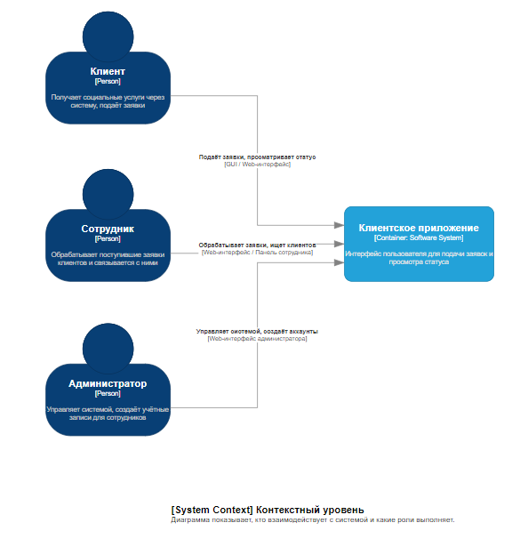

#### Контейнерный уровень
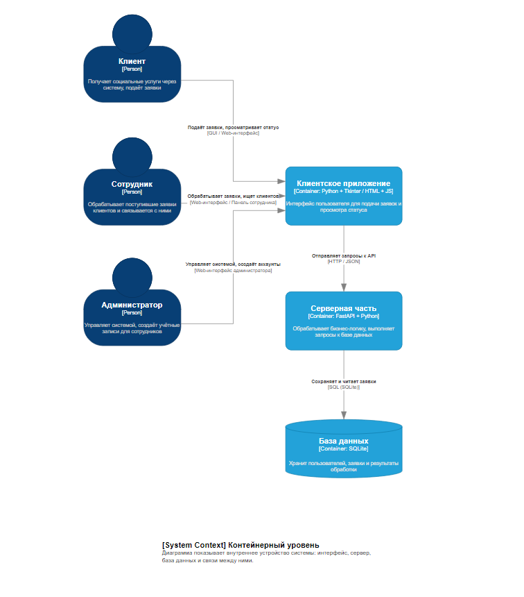

#### Компонентный уровень
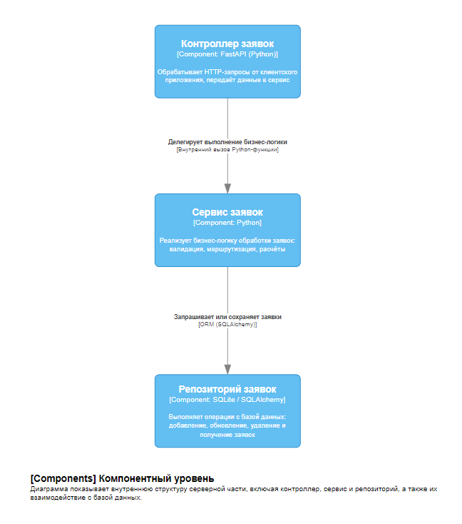

#### Кодовый уровень
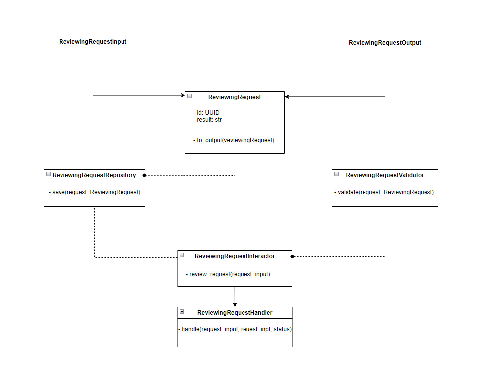

### Схема данных
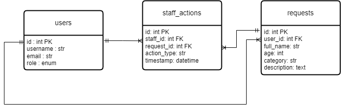

```sql
-- SQL-скрипт для создания базы данных
CREATE TABLE users (
    id INTEGER PRIMARY KEY AUTOINCREMENT,
    email TEXT UNIQUE NOT NULL,
    hashed_password TEXT NOT NULL,
    role TEXT NOT NULL
);

CREATE TABLE requests (
    id INTEGER PRIMARY KEY AUTOINCREMENT,
    user_id INTEGER NOT NULL,
    content TEXT NOT NULL,
    status TEXT DEFAULT 'pending',
    created_at TIMESTAMP DEFAULT CURRENT_TIMESTAMP,
    FOREIGN KEY(user_id) REFERENCES users(id)
);

CREATE TABLE staff_actions (
    id INTEGER PRIMARY KEY AUTOINCREMENT,
    request_id INTEGER NOT NULL,
    staff_id INTEGER NOT NULL,
    action TEXT NOT NULL,
    timestamp TIMESTAMP DEFAULT CURRENT_TIMESTAMP,
    FOREIGN KEY(request_id) REFERENCES requests(id),
    FOREIGN KEY(staff_id) REFERENCES users(id)
);
```

---

## **Функциональные возможности**

### Диаграмма вариантов использования
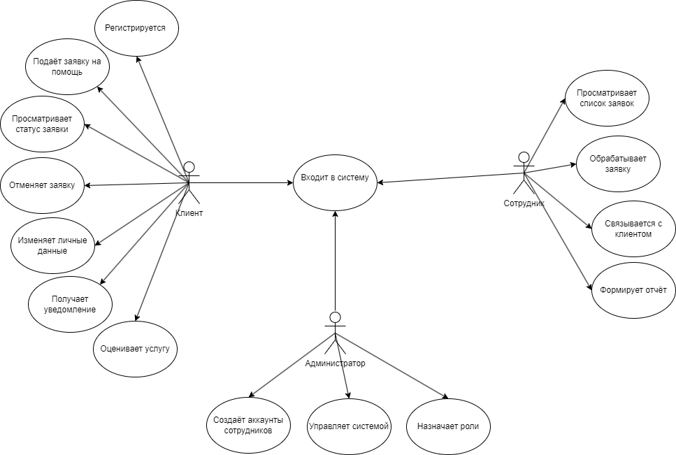

### User-flow диаграмма

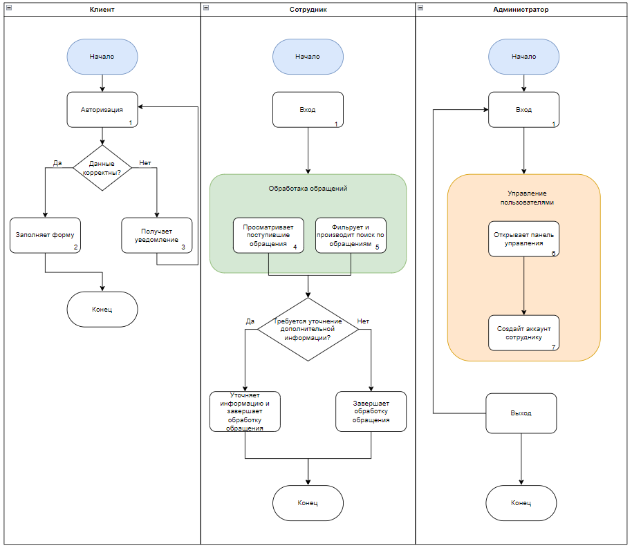


---

## **Детали реализации**

### UML-диаграммы

#### Диаграмма классов
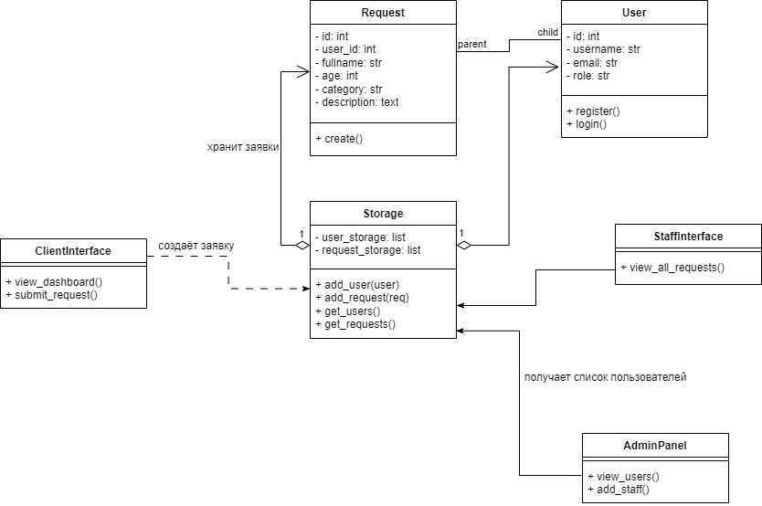

#### Диаграмма последовательностей
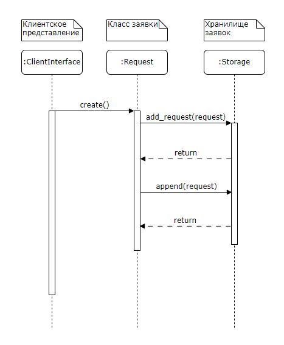

#### Диаграмма компонентов
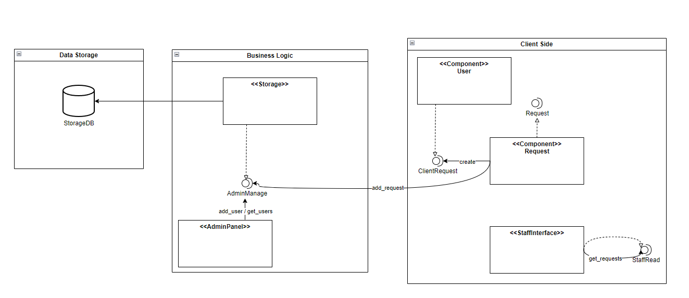

### Спецификация API

Открыть в браузере:  
[http://127.0.0.1:8000/docs](http://127.0.0.1:8000/docs)

OpenAPI YAML-файл: `openapi.json` генерируется автоматически.

### Безопасность

Использована JWT-аутентификация:
```python
from jose import jwt

def create_access_token(data: dict, expires_delta: timedelta = None):
    to_encode = data.copy()
    expire = datetime.utcnow() + (expires_delta or timedelta(minutes=ACCESS_TOKEN_EXPIRE_MINUTES))
    to_encode.update({"exp": expire})
    return jwt.encode(to_encode, SECRET_KEY, algorithm=ALGORITHM)
```

### Оценка качества кода

Анализ с использованием `flake8`, `pylint` и `radon`:
- Cyclomatic Complexity (radon): нормальный уровень
- Ошибки статики (`flake8`): отсутствуют
- Code Rating (`pylint`): > 8.0

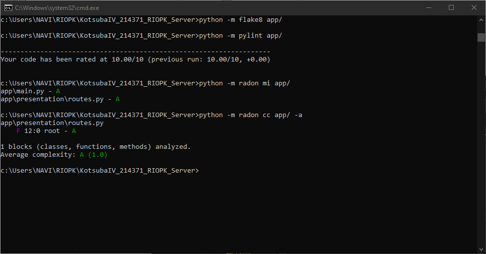

---

## **Тестирование**

### Unit-тесты

Покрытие:
- Проверка хеширования пароля
- Проверка генерации токена
- Проверка корневого эндпоинта `/`
- Проверка `/me`
- Проверка обработки входа

Файл: `app/tests/test_unit_auth.py`
```python
def test_verify_password():
    assert verify_password("123", get_password_hash("123"))
```

### Интеграционные тесты

Файл: `app/tests/test_integration_auth.py`, `app/tests/test_integration_protected.py`
```python
def test_login_user():
    response = client.post("/login", data={"email": "test@example.com", "password": "test"})
    assert response.status_code == 200
```

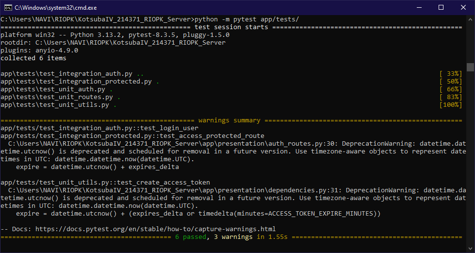

---

## **Установка и запуск**

### Манифесты для сборки docker образов

Файл `Dockerfile`:
```dockerfile
FROM python:3.10
WORKDIR /app
COPY . .
RUN pip install --no-cache-dir -r requirements.txt
CMD ["uvicorn", "app.main:app", "--host", "0.0.0.0", "--port", "8000"]
```

### Манифесты для развертывания k8s кластера

Файл `deployment.yaml`:
```yaml
apiVersion: apps/v1
kind: Deployment
metadata:
  name: riopk-app
spec:
  replicas: 1
  selector:
    matchLabels:
      app: riopk
  template:
    metadata:
      labels:
        app: riopk
    spec:
      containers:
        - name: riopk
          image: riopk:latest
          ports:
            - containerPort: 8000
```

---

## **Лицензия**

Этот проект лицензирован по лицензии MIT – подробности в файле [LICENSE.md](LICENSE.md)

---

## **Контакты**

Автор: Иван Коцуба  
Email: deadpool.minsk.2016@gmail.com
