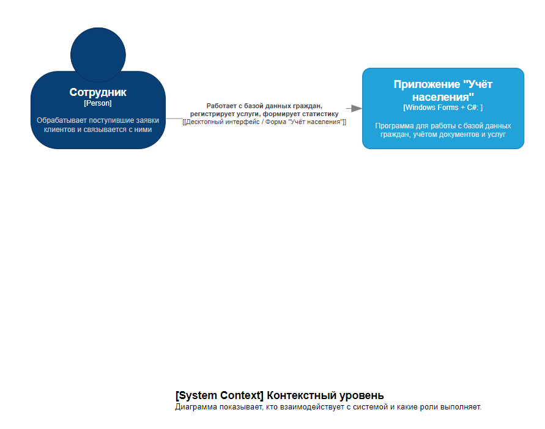
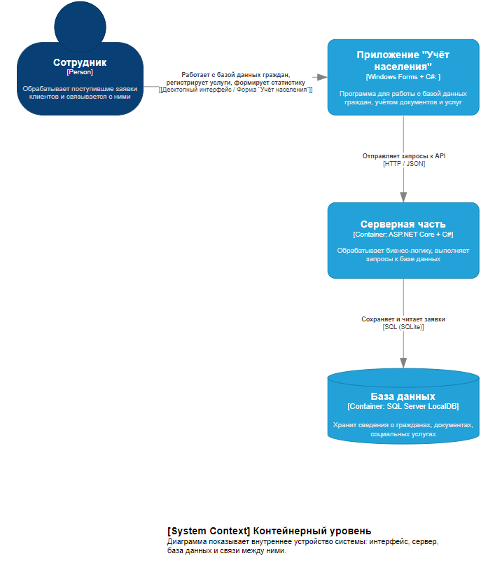
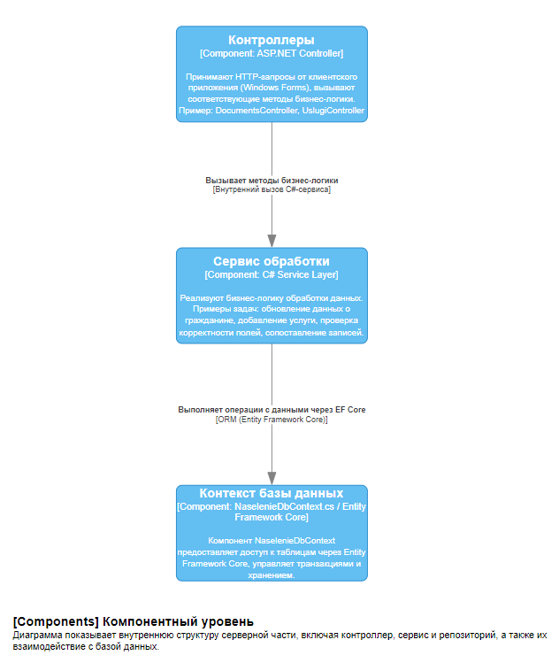
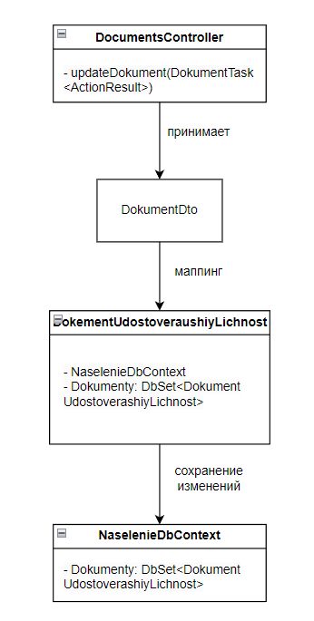
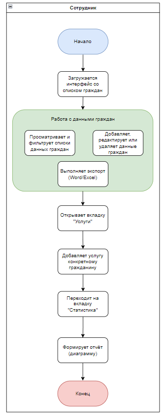
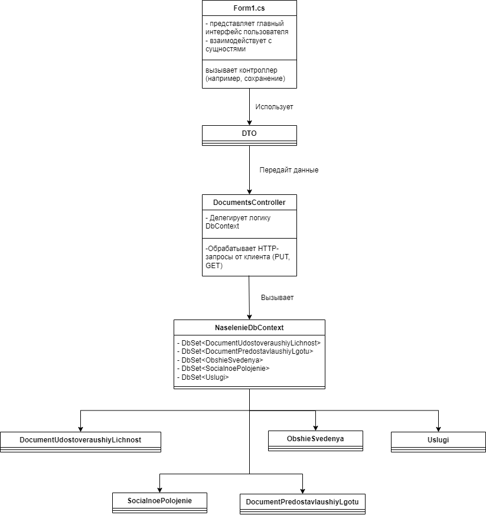
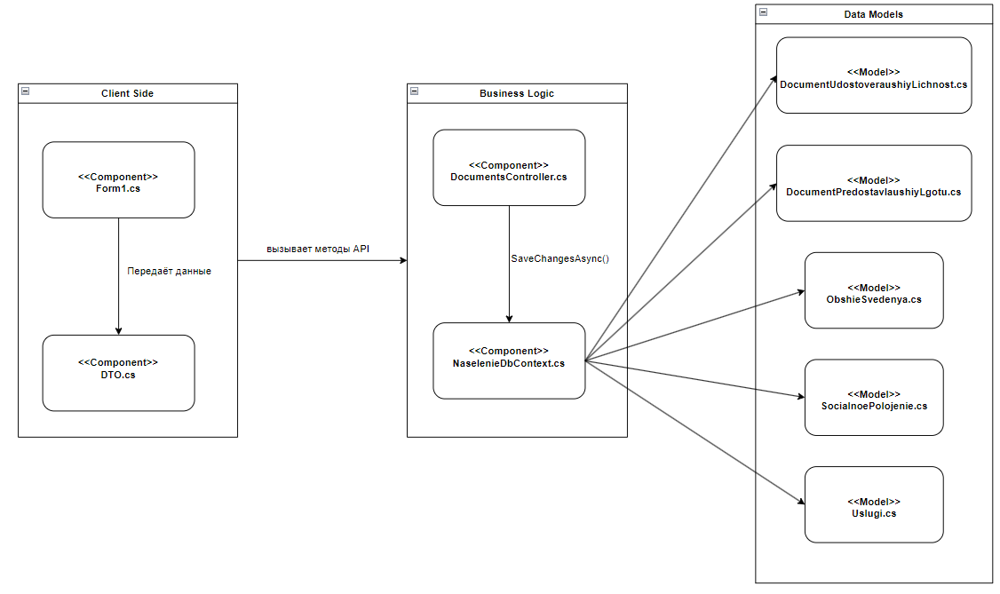
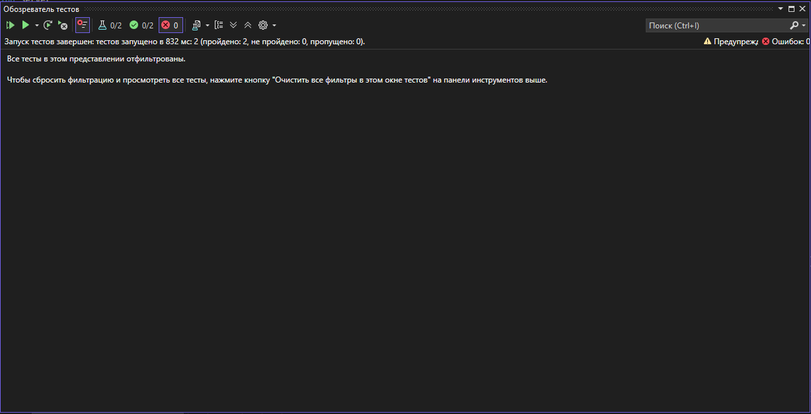

# **Программное средство «Учёт населения»**

Цель проекта — автоматизация деятельности центра социального обслуживания путём создания десктопного приложения для сотрудников. Система предназначена для учёта граждан, их социального положения, предоставленных услуг и генерации отчётности.

**Сервер**: [https://github.com/NAVI2734/KotsubaIV_214371_RIOPK_Server](https://github.com/NAVI2734/KotsubaIV_214371_RIOPK_Server)  
**Клиент**: [https://github.com/NAVI2734/KotsubaIV_214371_RIOPK_Client](https://github.com/NAVI2734/KotsubaIV_214371_RIOPK_Client)

---

## **Содержание**

1. [Архитектура](#архитектура)
2. [Функциональные возможности](#функциональные-возможности)
3. [Детали реализации](#детали-реализации)
4. [Документация OpenAPI](#документация-openapi)
5. [Аутентификация](#аутентификация)
6. [Тестирование](#тестирование)
7. [Развёртывание](#развёртывание)
8. [Руководство пользователя](#руководство-пользователя)
9. [Выводы](#выводы)

---

## **Архитектура**

### C4-модель

#### Контекстный уровень


#### Контейнерный уровень


#### Компонентный уровень


#### Кодовый уровень


---

## **Функциональные возможности**

- Учёт сведений о гражданах
- Хранение информации о документах и услугах
- Фильтрация и поиск записей
- Статистика в виде диаграмм
- Экспорт в Word и Excel
- Интерфейс полностью на русском языке

Диаграмма вариантов использования:


User Flow:


---

## **Детали реализации**

### Диаграммы UML

- Диаграмма классов  
  

- Диаграмма последовательностей  
  

- Диаграмма компонентов  
  

---

## **Документация OpenAPI**

Документация доступна по адресу: [http://localhost:7144/swagger](http://localhost:7144/swagger)

Пример эндпоинта:
```http
POST /api/Documents/saveDokumentUdostoveraushiyLichnost
```

Пример запроса:
```json
{
  "id": 1,
  "fio": "Иванов Иван",
  "tipDokumenta": "Паспорт",
  "seria": "AB",
  "nomer": "1234567",
  "dataVydachi": "2020-01-01",
  "dataOkonchaniya": "2030-01-01",
  "kemVydan": "ОВД"
}
```

---

## **Аутентификация**

Механизмы аутентификации не реализованы, так как система работает в однопользовательском режиме без доступа к сети. Это исключает необходимость в ролях и учётных записях.

---

## **Тестирование**

### Unit-тест

- Проверка успешного обновления записи
- Используется xUnit + Moq

### Интеграционный тест

- Проверка получения списка через реальный API
- Используется WebApplicationFactory



---

## **Развёртывание**

1. Установить Visual Studio 2022
2. Открыть решение
3. Выбрать стартовый проект `Учёт населения` (WinForms) или `Server` (API)
4. Нажать F5 для запуска

Swagger доступен на: http://localhost:7144/swagger

---

## **Руководство пользователя**

Запустить программу двойным кликом по exe-файлу.  
Основные действия:

- Добавление записи через форму
- Редактирование и удаление
- Экспорт в Word/Excel
- Построение статистики

Для вызова справки нажмите «Справка» в меню:


---

## **Выводы**

Разработана система, предназначенная для автоматизации учёта граждан. Использована архитектура клиент-сервер, реализованы основные CRUD-функции, а также экспорт и визуализация.  
Проект протестирован и готов к использованию в условиях центра социального обслуживания.
